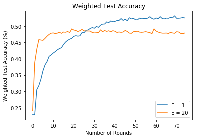
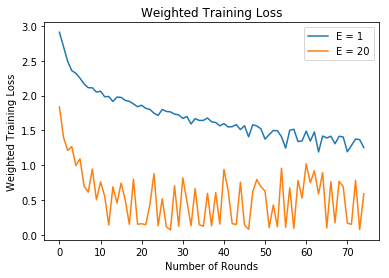

<h1> Convergence Behaviour of FederatedAveraging </h1>

In this experiment, we reproduce the convergence analysis experiment conducted in the [LEAF paper](https://arxiv.org/abs/1812.01097). Specifically, we investigate the convergence behaviour of `FedAvg` algorithm
when varying the number of local epochs, using the LEAF framework.

For this example, we shall use the Shakespeare dataset to perform a character-prediction task;
that is, given a statement by a character in a play, we shall try to predict the next character in the sentence.
For this experiment, we shall train a 2-layer LSTM model with cross-entropy loss, using randomly initialized word embeddings.

# Experiment Setup and Execution

## Quickstart script

In the interest of ease of use, we provide a script for execution of the experiment
for different number of local epochs, which may be executed as:

```bash
leaf/ $> ./shakespeare.sh <result-output-dir>
```

This script will execute the instructions provided below for local epoch values of 1 and 20,
reproducibly generating the data partitions and results observed by the authors during analysis.

## Dataset fetching and pre-processing

LEAF contains powerful scripts for fetching and conversion of data into JSON format for easy utilization.
Additionally, these scripts are also capable of subsampling from the dataset, and splitting the dataset
into training and testing sets.

For our experiment, as a first step, we shall use 5% of the dataset in an 90-10 train/test split,
and we shall discard all users with less than 64 samples. The following command shows
how this can be accomplished (the `--spltseed` and `--smplseed` flags in this case is to enable reproducible generation of the dataset)

```bash
leaf/data/shakespeare/ $> ./preprocess.sh --sf 0.05 -t sample --tf 0.9 -k 64 --smplseed 1550262838 --spltseed 1550262839
```

After running this script, the `data/shakespeare/data` directory should contain `train/` and `test/` directories.

## Model Execution

Now that we have our data, we can execute our model! For this experiment, the model file is stored
at `models/shakespeare/stacked_lstm.py`. In order train this model using `FedAvg` with 10 clients per round
and 1 local epoch per round, we execute the following command:

```bash
leaf/models $> python main.py -dataset shakespeare -model stacked_lstm --num-rounds 81 --clients-per-round 10 --num_epochs 1 -lr 0.8
```

## Metrics Collection

Executing the above command will write out system and statistical metrics to `leaf/models/metrics/stat_metrics.csv` and `leaf/models/metrics/sys_metrics.csv` - since these are overwritten for every run, we __highly recommend__ storing the generated metrics files at a different location.

To experiment with a different number of local epochs, re-run the main model script with a different `--num_epochs` flag. The plots shown below can be generated using `plots.py` file in the repo root.

# Results and Analysis

From the generated data, we computed the aggregate weighted training loss and training accuracy
(note that weighting is important to correct for label imbalance). Also, we note that `FedAvg`
method diverges as the number of local epochs increases.

<div style="text-align:center" markdown="1">




</div>

# More Information

More information about the framework, challenges and experiments can be found in the [LEAF paper](https://arxiv.org/abs/1812.01097). 
